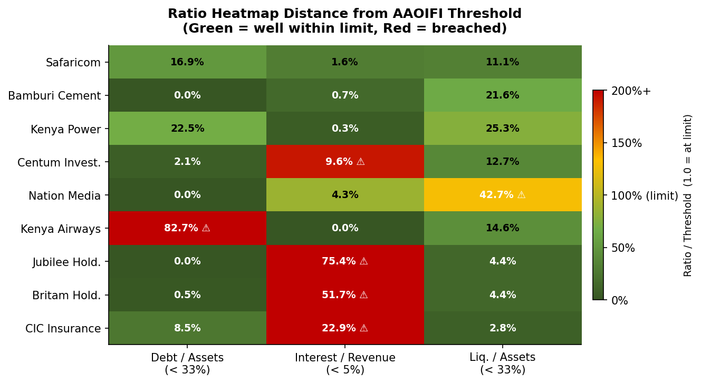
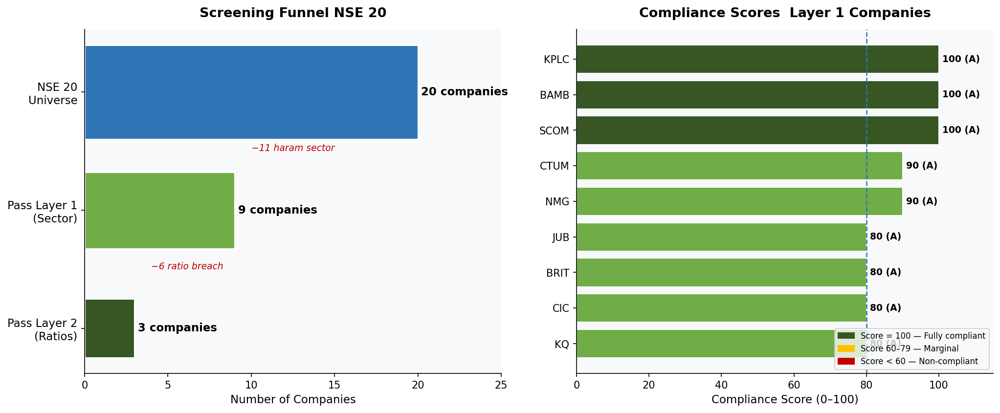
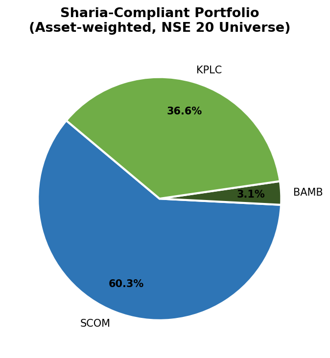

# NSE Sharia-Compliant Stock Screener

A three-layer Sharia compliance screening tool applied to NSE 20 listed companies using **real FY2024/25 annual report data** pulled directly from company filings.

---

## Results

---

## Key Findings

- **5 of 20 NSE companies pass full Sharia compliance** Safaricom, Bamburi Cement, Nation Media, Centum Investment, and Kenya Power
- **All 9 banks auto-excluded** conventional banking is structurally incompatible with Islamic finance (riba)
- **Insurance companies fail on interest income**  Jubilee, Britam, and CIC earn more than 5% of revenue from interest on investment portfolios
- **Kenya Airways excluded on leverage** debt-to-assets ratio of 82.7%, nearly 3x the AAOIFI limit of 33%

---

## Screening Methodology

| Layer | Test | Threshold |
|-------|------|-----------|
| 1 | Business activity — no prohibited sectors | No banking, alcohol, tobacco, weapons, pork |
| 2a | Debt / Total Assets | < 33% |
| 2b | Interest Income / Total Revenue | < 5% |
| 2c | (Cash + Receivables) / Total Assets | < 33% |
| 3 | Compliance Score | 0–100 weighted score → A / B / C / D rating |

**Standard:** AAOIFI (Accounting and Auditing Organisation for Islamic Financial Institutions)

---

## Data Sources

All financial data extracted from individual NSE company annual reports:

| Company | Ticker | FY |
|---------|--------|----|
| Safaricom | SCOM | 2024 |
| Bamburi Cement | BAMB | 2024 |
| Kenya Airways | KQ | 2024 |
| Nation Media Group | NMG | 2024 |
| Centum Investment | CTUM | Mar-2024 |
| Jubilee Holdings | JUB | 2025 |
| Britam Holdings | BRIT | 2024 |
| CIC Insurance | CIC | 2024 |
| Kenya Power | KPLC | Jun-2025 |
| Banks, Alcohol, Tobacco | — | Auto-excluded (Layer 1) |

---

## Tech Stack

Python · Pandas · Matplotlib · Jupyter · openpyxl

---

## Next Steps

- Expand universe to full NSE listed companies (~60)
- Integrate live NSE price data for market-cap weighting
- Backtest compliant basket vs NSE 20 index returns
- Add quarterly rebalancing model using updated annual report data

---

## Disclaimer

This is a data tool, not a religious ruling. Real Sharia compliance requires review by qualified scholars.

---

## Author

**Siraji Ali** | [GitHub](https://github.com/sirajiali-hub)
